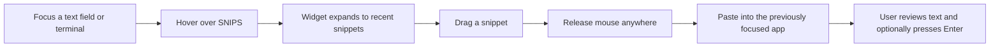
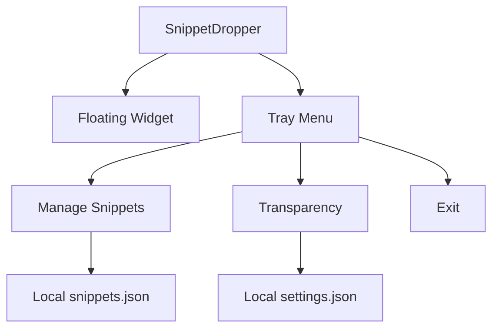

# SnippetDropper Product Design

## Product Summary

SnippetDropper is a lightweight floating utility for fast reuse of short text. Its core interaction is a drag gesture that ends in a reliable paste action.

The product is intentionally narrow: it solves repetitive typing without becoming a large clipboard manager or command launcher.

## Design Principles

### Stay Out Of The Way

The widget is small, always on top, and transparent while idle. It should remain available without competing with the main work area.

### Reveal On Intent

The command list is hidden until hover. This balances quick access with low visual noise.

### Preserve User Control

Dropping a terminal command pastes it but does not run it. The user can review the text and press `Enter`.

### Work Across Tools

The product uses drag-to-paste rather than native drag-and-drop. Native text drops are inconsistent across terminals, while clipboard paste works across Windows Terminal, PowerShell, Visual Studio Code terminals, editors, and many standard text fields.

## Interaction Model



## Widget States

### Idle

```text
+----------------------+
| SNIPS            ... |
+----------------------+
```

- Small horizontal bar
- Low opacity selected by the user
- Always on top
- Movable by dragging the header

### Hover

```text
+----------------------+
| SNIPS            ... |
+----------------------+
| flutter run          |
| flutter pub get      |
| flutter clean        |
| dart fix --apply     |
+----------------------+
```

- Expands vertically
- Shows four recent snippets
- Uses stronger opacity for readability

### Dragging

```text
                    +----------------+
                    | flutter run    |
                    +----------------+
```

- Shows a small floating preview near the pointer
- Keeps the previously focused app as the paste target
- Pastes only after mouse release

## Context Menu

```text
Manage snippets...
Transparency >
  10% transparent (nearly solid)
  30% transparent
  50% transparent
  70% transparent
  85% transparent (very faint)
------------------------------
Exit
```

## Snippet Manager

The manager supports:

- Add
- Update
- Remove
- Move up
- Move down
- Save and close
- Cancel

The interaction stays deliberately simple so configuration remains quick.

## Information Architecture



## Non-Goals

SnippetDropper is not currently intended to be:

- A clipboard history manager
- A password manager
- A cloud-synced snippet service
- A terminal emulator
- A macro engine that automatically executes commands

## Future Opportunities

- Keyboard shortcut to show or hide the widget
- Optional launch-on-Windows-startup setting
- Multiple snippet collections
- Search for larger snippet libraries
- Custom widget width and visible snippet count

