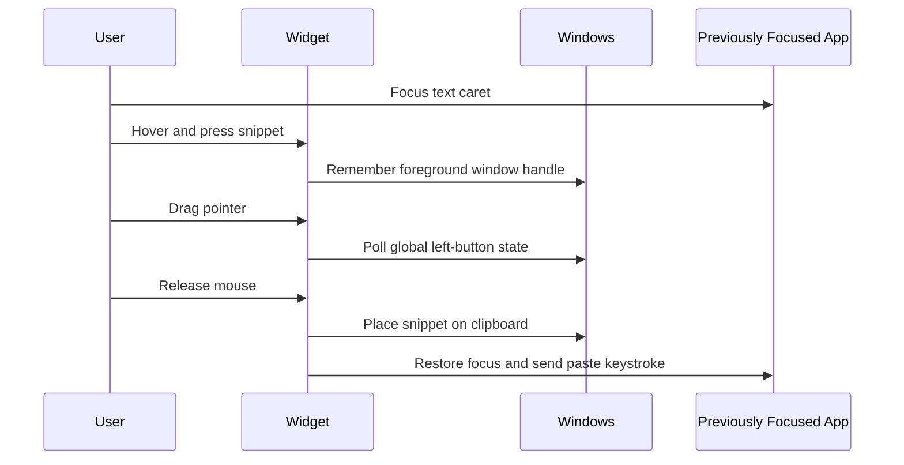

# SnippetDropper Technical Design

## Architecture

SnippetDropper is a dependency-free Windows Forms application written in C# and compiled with the built-in .NET Framework compiler available on Windows.

The repository produces two executables:

- `SnippetDropper.exe`: the portable desktop app
- `SnippetDropper-Setup.exe`: a per-user installer with the app embedded as a resource

## Runtime Flow



## Why Drag-To-Paste

Native OLE drag-and-drop text support varies across Windows applications and terminal hosts. SnippetDropper uses a drag gesture followed by clipboard paste so the interaction remains consistent across common terminals and editors.

## Paste Compatibility

- Standard apps receive `Ctrl+V`.
- Legacy `ConsoleWindowClass` windows receive `Shift+Insert`.
- The app remembers the foreground window before the drag begins.
- The widget uses a non-activating Windows style so clicking snippets does not steal focus.

## Storage

Installed and portable builds store user data under:

```text
%APPDATA%\SnippetDropper\
```

Files:

```text
snippets.json
settings.json
```

## Installation

`SnippetDropper-Setup.exe`:

1. Extracts the embedded portable executable to `%LOCALAPPDATA%\SnippetDropper\SnippetDropper.exe`.
2. Creates a Start Menu shortcut.
3. Optionally creates a Desktop shortcut.
4. Launches the installed app.

Installation is per-user and does not require administrator access.

## Build

From the repository root:

```powershell
powershell.exe -NoProfile -ExecutionPolicy Bypass -File .\Build-SnippetDropper.ps1
```

## Known Limitation

Windows prevents a normal process from injecting paste keystrokes into an administrator-elevated terminal. To paste into an elevated terminal, launch SnippetDropper with the same elevation level.

